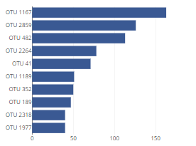
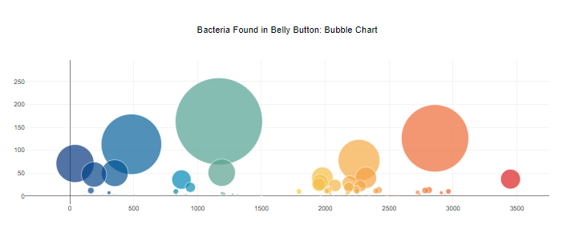
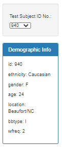

# Plot.ly Challenge - Belly Button Biodiversity
## UC Davis Data Analytics and Visualization Boot Camp 2021

  

## Description
In this repository, I have built an interactive dashboard to explore the [Belly Button Biodiversity dataset](http://robdunnlab.com/projects/belly-button-biodiversity/), which catalogs the microbes that colonize human navels. The dashboard is deployed on Github pages, available on this [link](https://speedracer05.github.io/Plotly-Challenge/).

## Table of Contents
-   [Description](#description)
-   [Step 1: Plotly](#step-1-plotly)
-   [Deployment](#deployment)
-   [Tools and Sources](#tools-and-sources)
-   [Resources](#resources)
-   [Contact](#contact)

## Step 1: Plotly
1. Use the D3 library to read in samples.json.
2. Create a horizontal bar chart with a dropdown menu to display the top 10 OTUs found in that individual.
  - Use sample_values as the values for the bar chart.
  - Use otu_ids as the labels for the bar chart.
  - Use otu_labels as the hovertext for the chart

3. Create a bubble chart that displays each sample.
  - Use otu_ids for the x values.
  - Use sample_values for the y values.
  - Use sample_values for the marker size.
  - Use otu_ids for the marker colors.
  - Use otu_labels for the text values.

  

4. Display the sample metadata, i.e., an individual's demographic information.
5. Display each key-value pair from the metadata JSON object somewhere on the page.

  

7. Update all of the plots any time that a new sample is selected.

## Deployment
The app was deployed to GitHub Pages, and is available [here](https://speedracer05.github.io/Plotly-Challenge/).

## Tools and Sources
`Plot.ly`
`JavaScript`
`HTML`
`JSON`
`D3.js`
`GitHub and GitHub Pages`
`conda install -c conda-forge nodejs`
## Resources
1. Future implementation resources
  - [Responsive Tables](https://codepen.io/gumetis/pen/OJPNxwy)
2. [Searchable Tables](https://codepen.io/adobewordpress/pen/gbewLV)
## Contact
[John Chan](https://github.com/speedracer05)

## About the Data

Hulcr, J. et al.(2012) _A Jungle in There: Bacteria in Belly Buttons are Highly Diverse, but Predictable_. Retrieved from: [http://robdunnlab.com/projects/belly-button-biodiversity/results-and-data/](http://robdunnlab.com/projects/belly-button-biodiversity/results-and-data/)

- - -

