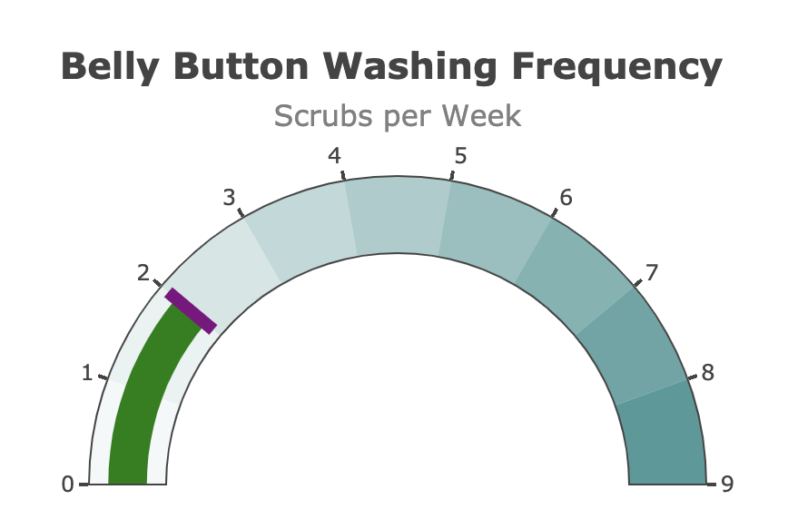

# Plot.ly Challenge

## Description
In this project challenge, I have built an interactive dashboard to explore the [Belly Button Biodiversity dataset](http://robdunnlab.com/projects/belly-button-biodiversity/), which catalogs the microbes that colonize human navels.

## Table of Contents
-   [Description](#description)
-   [Installation and Deployment](#installation-and-deployment)
-   [D3 Visualization](#d3-visualization)
-   [Technology](#technology)
-   [Resources](#resources)
-   [Contact](#contact)

## Installation and Deployment
1. `conda install -c conda-forge nodejs`

## D3 Visualizaton
A basic HTML page was created, showing the data that was extracted, and presented in table form.

## Technology
`JavaScript`
`HTML`
`JSON`

## Development Notes
I reviewed the dataset saved as
The dataset reveals that a small handful of microbial species (also called operational taxonomic units, or OTUs, in the study) were present in more than 70% of people, while the rest were relatively rare.

## Resources
1. Future implementation resources
  - [Responsive Tables](https://codepen.io/gumetis/pen/OJPNxwy)
3. [Searchable Tables](https://codepen.io/adobewordpress/pen/gbewLV)

## Contact
[John Chan](https://github.com/speedracer05)

Additionally, you are welcome to create any layout that you would like for your dashboard. An example dashboard is shown below:

## Advanced Challenge Assignment (Optional)

The following task is advanced and therefore optional.

* Adapt the Gauge Chart from <https://plot.ly/javascript/gauge-charts/> to plot the weekly washing frequency of the individual.

* You will need to modify the example gauge code to account for values ranging from 0 through 9.

* Update the chart whenever a new sample is selected.

## Deployment

* Deploy your app to a free static page hosting service, such as GitHub Pages. Submit the links to your deployment and your GitHub repo.

* Ensure your repository has regular commits (i.e. 20+ commits) and a thorough README.md file

## Hints

* Use `console.log` inside of your JavaScript code to see what your data looks like at each step.

* Refer to the [Plotly.js documentation](https://plot.ly/javascript/) when building the plots.

## Rubric

[Unit 15 Rubric - Plot.ly Homework - Belly Button Biodiversity](https://docs.google.com/document/d/14ZKfNF4ws6CxlUsrhI81Q3YD06h0QQ1PbZa6BMnr7w4/edit?usp=sharing)

- - -

## References

Hulcr, J. et al.(2012) _A Jungle in There: Bacteria in Belly Buttons are Highly Diverse, but Predictable_. Retrieved from: [http://robdunnlab.com/projects/belly-button-biodiversity/results-and-data/](http://robdunnlab.com/projects/belly-button-biodiversity/results-and-data/)

- - -

© 2021 Trilogy Education Services, LLC, a 2U, Inc. brand. Confidential and Proprietary. All Rights Reserved.
